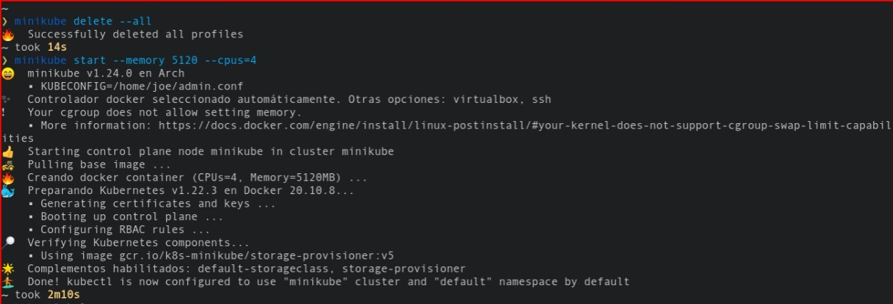
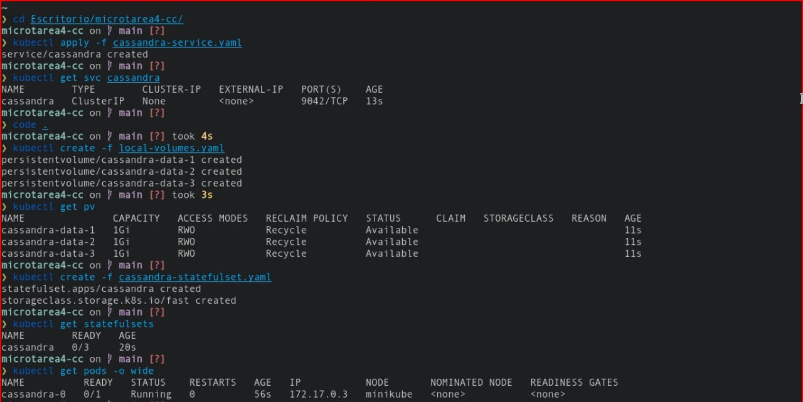

# microtarea4-cc
Microtarea 4 de Cloud Computing

## Dataset de pruebas

Para el dataset utilizaremos información se utilizará con el script de 'local-values.yaml'.

## Escalabilidad Vertical

Para poder aumentar o disminuir la cantidad de pods utilizando StatefulSet se hace con el siguiente comando:



```
kubectl scale --replicas=4 statefulset/cassandra
```


Con ello pasamos de tener 3 pods a 4.

## Escalabilidad Horizontal

Para aumentar o disminuir la cantidad de nodos utilizando k8ssandra es:
```
```

## Conclusiones

Cassandra es una base de datos escalable que nos permite separar la información a través de keys especificados por el usuario, y con minikube y k8ssandra podemos configurar y desplegar cassandra en kubernetes.

### Integrantes
- Joe Acuña
- Bryan Díaz
